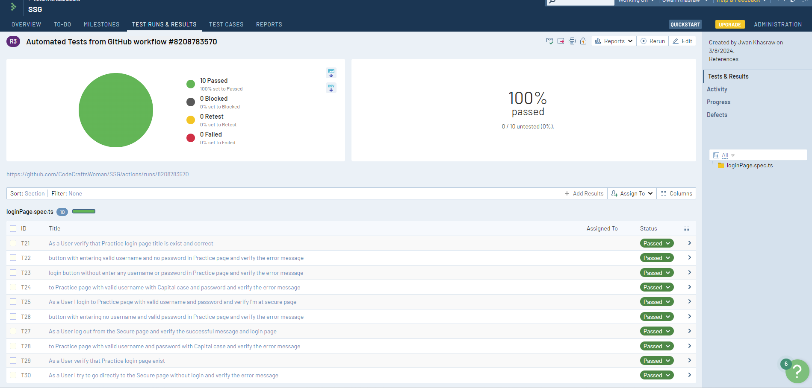

# Playwright UI Test Framework

To run tests in your local, make sure you have nodeJS

``` shell
npm install
npm run smoke-test
```

Test Run on Github Actions
- Everyday at 5 AM
- every push to main

Test Results go to the TestRail
